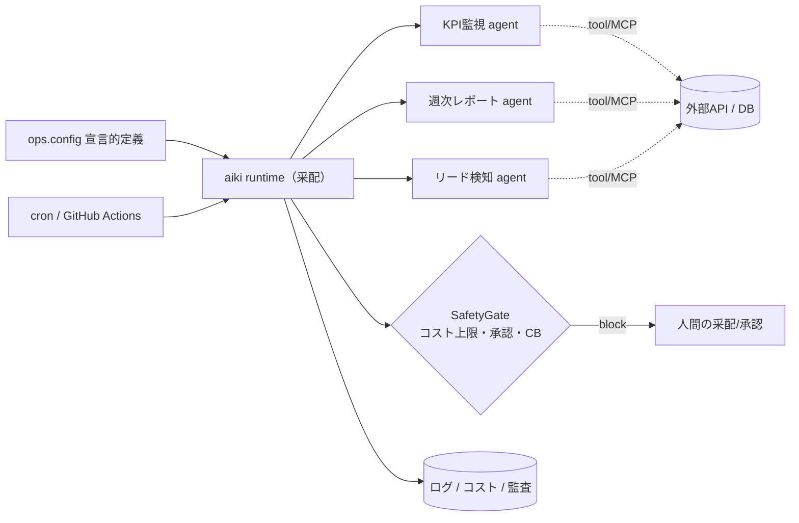

<div align="center">

# aiki（合気）

**人が采配し、AIエージェントが"事業の運用"を回す — AI駆動 事業運用OS**

`Claude Code` × `MCP` × `GitHub Actions` の上で、役割を持ったエージェント群を
スケジュール実行し、**コスト上限・承認ゲート・監査ログ**で安全に自律運用するための最小フレームワーク。

</div>

---

> 🧭 **何が違うのか**
> AI駆動開発のツールはコード生成・クリエイティブ生成に集中しがち。aiki が狙うのは
> **「事業のオペレーション（収集→分析→意思決定支援→実行→報告）そのものの自律化」**。
> エンジニアリングと事業運用の両方を、宣言的な設定一つで回す。

## なぜ作ったか
少人数で複数の事業を回すには、「人が全部やる」でも「AIに丸投げ」でもなく、
**人が采配（方針・承認）し、AIエージェントが定常運用を担う**分業が要る。
aiki はその分業を、安全レイヤ付きで誰でも再現できる形にする。

## コア概念
| 概念 | 役割 |
|---|---|
| **Agent** | 役割（例: KPI監視 / 週次レポート / リード検知）を持つ実行単位 |
| **Schedule** | いつ回すか（cron / GitHub Actions） |
| **SafetyGate** | コスト上限・サーキットブレーカー・人間承認で暴走を遮断 |
| **Observability** | 実行ログ・コスト・成否を記録、乖離時に停止 |

## アーキテクチャ


## クイックスタート
```bash
npm i
npm run ops        # examples/ops.config の事業運用を1サイクル実行（安全ゲート込み）
npm test
npm run typecheck
```

## 事業運用の宣言（`examples/ops.config.ts`）
```ts
import { kpiWatch, japaneseMlbRanking } from "../src/agents";

export default defineOps({
  budgetUsd: 1.0,                                    // 1サイクルのコスト上限
  agents: [
    { ...kpiWatch,           schedule: "0 9 * * *" },  // 事業KPI監視
    { ...japaneseMlbRanking, schedule: "0 10 * * 1" }, // 日本人MLB OPS（実データ showcase）
  ],
});
```

## 現状（v0.1・正直版）
- ✅ ランタイム / 役割エージェント / リトライ・失敗隔離 / コスト上限 / 監査ログ / Actions実行
- ✅ 実データ showcase: 日本人MLB野手 OPSランキング（MLB公開API `statsapi.mlb.com`、APIキー不要）
- 🚧 ロードマップ: MCPツール標準アダプタ、承認のWeb UI、コスト実測連携、エージェント間メモリ永続化 → [docs/ROADMAP.md](docs/ROADMAP.md)

> v0.1 は「動く骨格」。本番運用の主張は実適用後に更新します（コード完成 ≠ 本番運用）。

## ライセンス
MIT

---
📣 AI駆動 事業運用・AIエージェント基盤の導入相談を **週3〜 / 平日日中 / フルリモート** で受付中 → [GitHub](https://github.com/yu010101) / [AI-Driven-School](https://github.com/AI-Driven-School)
